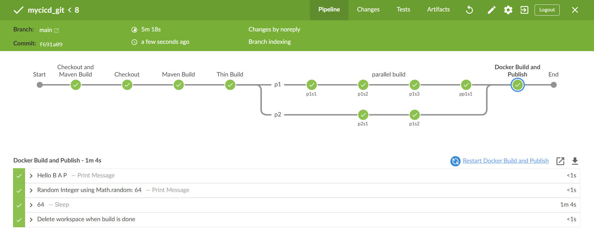

# CI/CD by Jenkins
This project is intended to create a Jenkins pipeline as a template whoever can use it for their own automation.

Demonstration by Docker image.<br>
I use WSL (Ubuntu) on Windows.

```
docker run -d \
  --name jenkins \
  -p 8080:8080 \
  -p 50000:50000 \
  -v jenkins_home:/var/jenkins_home \
  jenkins/jenkins:lts-jdk17
```

Once run the command, we can access the Jenkins GUI
Then, we can find the initial password location /var/jenkins_home/secrets/initialAdminPassword

Get the initial password 
```
docker exec -it  jenkins  cat /var/jenkins_home/secrets/initialAdminPassword
```
Follow the Screens until installation is completed. ( default is fine )

## Plugin required
Install Blue Ocean Aggregater

## First cicd project

Select Newproject -> Multibranch Pipeline

**Please make sure you have the correct filename in the Script Path field of the Build Configuration. Unless very hard to notice it.**

Note: I added a sleep command in Jenkins file to see how the flow happened

This is a simple template for CI/CD implementation using Jenkins and this can be used for a starting point for  your production-grade deployments.



**If  gitlab is used, use AccessToken for password.**

# Try It yourself. It is easy
